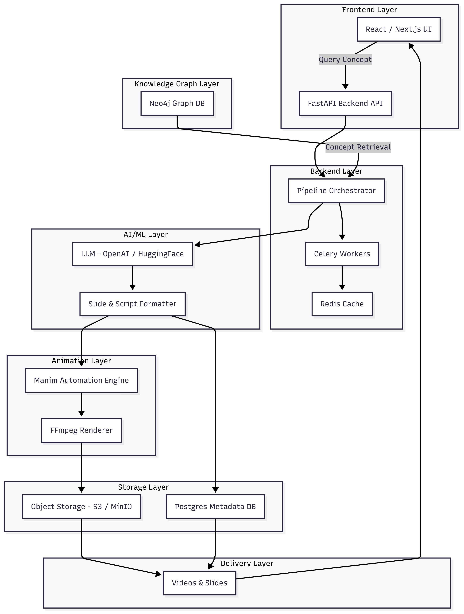

# System Design: AI-Powered Knowledge Graph to Manim Animation Automation

## Table of Contents
1. [System Overview](#system-overview)
2. [Architecture Diagram](#architecture-diagram)
3. [Component Details](#component-details)
4. [Data Flow](#data-flow)
5. [API Design](#api-design)
6. [Database Schema](#database-schema)
7. [Scalability Considerations](#scalability-considerations)
8. [Trade-offs and Design Decisions](#trade-offs-and-design-decisions)
9. [Implementation Approach](#implementation-approach)

## System Overview

### Problem Statement
Students need personalized educational videos for complex concepts across domains like GIS, Space Tech, and Data Structures & Algorithms. Manual video creation is time-intensive and doesn't scale. Our system automates this process using AI and knowledge graphs.

### Solution
An end-to-end pipeline that:
- Stores educational content in a Neo4j knowledge graph
- Uses AI to generate contextual slides and scripts
- Automatically creates animated videos using Manim
- Delivers content through a responsive web interface

### Key Features
- **Intelligent Content Retrieval**: Query knowledge graph for related concepts
- **AI-Powered Generation**: Create slides and scripts using LLMs
- **Automated Animation**: Convert content to educational videos
- **Multi-Domain Support**: Extensible for various educational domains
- **Scalable Processing**: Distributed task processing with Celery

## Architecture Diagram


## Component Details

### 1. Frontend Layer (React/Next.js)
**Purpose**: User interface for concept queries and video consumption

**Key Components**:
- **Search Interface**: Natural language concept search
- **Video Player**: Stream generated educational videos
- **Progress Tracker**: Show generation status
- **Domain Selector**: Choose specific educational domains

```javascript
// Pseudocode for Frontend Component
class ConceptSearchInterface {
    handleSearch(query) {
        // Validate and sanitize query
        // Send API request to backend
        // Show loading state
        // Handle response/errors
    }
    
    displayResults(videos, slides, metadata) {
        // Render video player
        // Show slides alongside video
        // Display concept relationships
    }
}
```

### 2. Backend API Layer (FastAPI)
**Purpose**: Handle requests, orchestrate pipeline, manage authentication

**Key Endpoints**:
```python
# Pseudocode for API Endpoints
@app.post("/api/v1/generate-video")
async def generate_video(concept_query: ConceptQuery):
    """
    Main endpoint for video generation
    """
    # 1. Validate input
    # 2. Queue generation task
    # 3. Return task ID
    task_id = queue_generation_task(concept_query)
    return {"task_id": task_id, "status": "queued"}

@app.get("/api/v1/task-status/{task_id}")
async def get_task_status(task_id: str):
    """
    Get generation progress
    """
    status = get_task_progress(task_id)
    return {"status": status, "progress": progress_percentage}

@app.get("/api/v1/concepts/{domain}")
async def get_domain_concepts(domain: str):
    """
    Retrieve available concepts for a domain
    """
    concepts = knowledge_graph.get_concepts_by_domain(domain)
    return {"concepts": concepts}
```

### 3. Pipeline Orchestrator
**Purpose**: Coordinate the entire generation workflow

```python
# Pseudocode for Pipeline Orchestrator
class VideoGenerationPipeline:
    def __init__(self):
        self.knowledge_graph = Neo4jConnector()
        self.llm_service = LLMService()
        self.manim_engine = ManimEngine()
        self.storage = S3Storage()
    
    async def generate_educational_video(self, concept_query):
        """
        Main pipeline execution
        """
        try:
            # Step 1: Knowledge Retrieval
            concept_data = await self.retrieve_concept_knowledge(concept_query)
            
            # Step 2: Content Generation
            slides, script = await self.generate_content(concept_data)
            
            # Step 3: Animation Creation
            video_path = await self.create_animation(slides, script)
            
            # Step 4: Storage and Metadata
            video_url = await self.store_and_index(video_path, concept_query)
            
            return video_url
            
        except Exception as e:
            # Handle errors and cleanup
            self.handle_pipeline_error(e)
    
    async def retrieve_concept_knowledge(self, concept_query):
        """
        Query knowledge graph for relevant information
        """
        # Cypher query to get concept and related nodes
        query = """
        MATCH (c:Concept {name: $concept_name})
        MATCH (c)-[r]-(related)
        RETURN c, r, related
        LIMIT 50
        """
        return self.knowledge_graph.execute_query(query, concept_name=concept_query.name)
```

### 4. Knowledge Graph (Neo4j)
**Purpose**: Store and organize educational content with relationships

**Graph Schema Design**:
```cypher
// Pseudocode for Neo4j Schema
// Core Nodes
CREATE CONSTRAINT concept_name IF NOT EXISTS FOR (c:Concept) REQUIRE c.name IS UNIQUE;
CREATE CONSTRAINT domain_name IF NOT EXISTS FOR (d:Domain) REQUIRE d.name IS UNIQUE;

// Node Types
(:Concept {name, description, difficulty_level, tags[]})
(:Domain {name, description})
(:Book {title, author, isbn})
(:Chapter {title, number, content})
(:Example {description, code, explanation})
(:Prerequisite {name, importance_level})

// Relationship Types
(:Concept)-[:BELONGS_TO]->(:Domain)
(:Concept)-[:REQUIRES]->(:Prerequisite)
(:Concept)-[:EXEMPLIFIED_BY]->(:Example)
(:Concept)-[:RELATED_TO]->(:Concept)
(:Concept)-[:PART_OF]->(:Chapter)
(:Chapter)-[:BELONGS_TO]->(:Book)
```

**Knowledge Retrieval Algorithm**:
```python
# Pseudocode for Knowledge Retrieval
class KnowledgeGraphService:
    def get_concept_with_context(self, concept_name, depth=2):
        """
        Retrieve concept with related information
        """
        query = """
        MATCH (c:Concept {name: $concept_name})
        OPTIONAL MATCH path = (c)-[*1..{}]-(related)
        WHERE related:Concept OR related:Example OR related:Prerequisite
        RETURN c, collect(DISTINCT related) as context
        """.format(depth)
        
        result = self.db.execute_query(query, concept_name=concept_name)
        return self.format_concept_data(result)
    
    def format_concept_data(self, raw_data):
        """
        Structure data for LLM consumption
        """
        return {
            "main_concept": raw_data.main_concept,
            "prerequisites": raw_data.prerequisites,
            "examples": raw_data.examples,
            "related_concepts": raw_data.related_concepts
        }
```

### 5. AI/ML Layer
**Purpose**: Generate educational content using Language Models

```python
# Pseudocode for LLM Service
class LLMContentGenerator:
    def __init__(self):
        self.llm_client = OpenAIClient()  # or HuggingFace
    
    async def generate_slides_and_script(self, concept_data):
        """
        Generate structured educational content
        """
        # Create prompt template
        prompt = self.build_educational_prompt(concept_data)
        
        # Generate content
        response = await self.llm_client.generate(
            prompt=prompt,
            max_tokens=4000,
            temperature=0.7,
            response_format="structured_json"
        )
        
        return self.parse_llm_response(response)
    
    def build_educational_prompt(self, concept_data):
        """
        Create context-aware prompt for content generation
        """
        return f"""
        Create an educational presentation for the concept: {concept_data.main_concept.name}
        
        Context:
        - Prerequisites: {concept_data.prerequisites}
        - Examples: {concept_data.examples}
        - Related concepts: {concept_data.related_concepts}
        
        Generate:
        1. 8-10 slides with titles and bullet points
        2. Detailed script for each slide (2-3 minutes speaking time)
        3. Visual descriptions for animations
        4. Code examples where applicable
        
        Format as JSON with slides and script arrays.
        """
    
    def parse_llm_response(self, response):
        """
        Structure LLM output for animation pipeline
        """
        content = json.loads(response.content)
        return {
            "slides": content["slides"],
            "script": content["script"],
            "visual_descriptions": content["visuals"]
        }
```

### 6. Slide & Script Formatter
**Purpose**: Convert LLM output to Manim-compatible format

```python
# Pseudocode for Content Formatter
class ManimContentFormatter:
    def format_for_manim(self, llm_content):
        """
        Convert LLM output to Manim scene descriptions
        """
        scenes = []
        
        for slide in llm_content["slides"]:
            scene = {
                "type": self.determine_scene_type(slide),
                "title": slide["title"],
                "content": slide["content"],
                "animations": self.generate_animation_sequence(slide),
                "duration": self.calculate_duration(slide["script"])
            }
            scenes.append(scene)
        
        return scenes
    
    def determine_scene_type(self, slide):
        """
        Classify slide type for appropriate Manim template
        """
        if "code" in slide["content"]:
            return "CodeScene"
        elif "graph" in slide["content"] or "diagram" in slide["content"]:
            return "DiagramScene"
        elif "formula" in slide["content"] or "equation" in slide["content"]:
            return "MathScene"
        else:
            return "TextScene"
    
    def generate_animation_sequence(self, slide):
        """
        Define animation timing and effects
        """
        return {
            "fade_in": ["title"],
            "write_gradually": ["main_content"],
            "highlight": ["key_points"],
            "transform": ["examples"]
        }
```

### 7. Manim Automation Engine
**Purpose**: Generate animated videos from formatted content

```python
# Pseudocode for Manim Engine
class ManimVideoGenerator:
    def __init__(self):
        self.scene_templates = self.load_scene_templates()
    
    async def generate_video(self, formatted_scenes):
        """
        Create complete educational video
        """
        video_parts = []
        
        for scene_data in formatted_scenes:
            # Generate individual scene
            scene_file = await self.create_scene(scene_data)
            video_parts.append(scene_file)
        
        # Combine all scenes
        final_video = await self.combine_scenes(video_parts)
        return final_video
    
    async def create_scene(self, scene_data):
        """
        Generate individual scene using Manim
        """
        scene_class = self.get_scene_template(scene_data["type"])
        
        # Generate Manim Python code
        manim_code = self.generate_manim_code(scene_data, scene_class)
        
        # Execute Manim rendering
        output_file = await self.render_scene(manim_code)
        return output_file
    
    def generate_manim_code(self, scene_data, template):
        """
        Generate executable Manim Python code
        """
        return f"""
from manim import *

class EducationalScene(Scene):
    def construct(self):
        # Title
        title = Text("{scene_data['title']}", font_size=48)
        title.to_edge(UP)
        self.play(FadeIn(title))
        
        # Main content
        content = VGroup()
        for item in {scene_data['content']}:
            text = Text(item, font_size=32)
            content.add(text)
        
        content.arrange(DOWN, aligned_edge=LEFT)
        content.next_to(title, DOWN, buff=1)
        
        self.play(Write(content))
        self.wait(2)
        
        # Animations based on content type
        {self.generate_custom_animations(scene_data)}
        """
    
    async def render_scene(self, manim_code):
        """
        Execute Manim rendering process
        """
        # Write code to temporary file
        temp_file = f"/tmp/scene_{uuid.uuid4()}.py"
        with open(temp_file, 'w') as f:
            f.write(manim_code)
        
        # Execute Manim command
        cmd = f"manim {temp_file} EducationalScene -q high"
        process = await asyncio.create_subprocess_shell(cmd)
        await process.wait()
        
        # Return path to generated video
        return f"/tmp/media/videos/scene_{uuid.uuid4()}/1080p60/EducationalScene.mp4"
```

### 8. Storage Layer
**Purpose**: Manage video files and metadata

```python
# Pseudocode for Storage Service
class StorageService:
    def __init__(self):
        self.s3_client = S3Client()
        self.metadata_db = PostgresClient()
    
    async def store_video(self, video_path, concept_metadata):
        """
        Store video and create metadata record
        """
        # Upload to S3/MinIO
        s3_url = await self.s3_client.upload_file(
            file_path=video_path,
            bucket="educational-videos",
            key=f"videos/{concept_metadata.id}/{uuid.uuid4()}.mp4"
        )
        
        # Store metadata in PostgreSQL
        video_record = {
            "id": uuid.uuid4(),
            "concept_name": concept_metadata.concept_name,
            "s3_url": s3_url,
            "duration": concept_metadata.duration,
            "created_at": datetime.utcnow(),
            "generation_params": concept_metadata.params
        }
        
        await self.metadata_db.insert("videos", video_record)
        return video_record
```

## Data Flow

### Complete Request Flow:
1. **User Request**: Student searches for "Binary Search Tree traversal"
2. **Query Processing**: API validates and queues the request
3. **Knowledge Retrieval**: Neo4j returns BST concept with related algorithms, examples
4. **Content Generation**: LLM creates 8 slides covering BST basics, traversal methods, code examples
5. **Content Formatting**: Formatter structures content for Manim scenes
6. **Video Generation**: Manim creates animated scenes showing tree structure, traversal visualization
7. **Storage**: Video uploaded to S3, metadata stored in PostgreSQL
8. **Delivery**: User receives video URL and can stream educational content

## API Design

### RESTful Endpoints:
```
POST /api/v1/videos/generate
GET /api/v1/videos/{video_id}
GET /api/v1/tasks/{task_id}/status
GET /api/v1/concepts/search?q={query}
GET /api/v1/domains
POST /api/v1/knowledge/upload
```

### WebSocket for Real-time Updates:
```javascript
// Pseudocode for WebSocket communication
class VideoGenerationSocket {
    connect(taskId) {
        this.socket = new WebSocket(`ws://api/v1/tasks/${taskId}/updates`);
        
        this.socket.onmessage = (event) => {
            const update = JSON.parse(event.data);
            this.handleProgressUpdate(update);
        };
    }
    
    handleProgressUpdate(update) {
        // Update UI with generation progress
        // Show current step: "Generating slides...", "Creating animations..."
    }
}
```

## Database Schema

### PostgreSQL (Metadata):
```sql
-- Video metadata
CREATE TABLE videos (
    id UUID PRIMARY KEY,
    concept_name VARCHAR(255) NOT NULL,
    domain VARCHAR(100),
    s3_url TEXT NOT NULL,
    duration INTEGER, -- seconds
    quality VARCHAR(20) DEFAULT 'high',
    created_at TIMESTAMP DEFAULT CURRENT_TIMESTAMP,
    generation_params JSONB
);

-- Generation tasks
CREATE TABLE generation_tasks (
    id UUID PRIMARY KEY,
    user_id UUID,
    concept_query TEXT NOT NULL,
    status VARCHAR(50) DEFAULT 'queued',
    progress INTEGER DEFAULT 0,
    created_at TIMESTAMP DEFAULT CURRENT_TIMESTAMP,
    completed_at TIMESTAMP,
    error_message TEXT
);

CREATE INDEX idx_videos_concept ON videos(concept_name);
CREATE INDEX idx_tasks_status ON generation_tasks(status);
```

### Redis (Caching & Sessions):
```python
# Cache structure
cache_keys = {
    "concept_data": "kg:concept:{concept_name}",
    "generated_content": "llm:content:{concept_hash}",
    "task_status": "task:status:{task_id}",
    "user_session": "session:{user_id}"
}
```

## Scalability Considerations

### Horizontal Scaling:
- **API Layer**: Multiple FastAPI instances behind load balancer
- **Worker Pool**: Auto-scaling Celery workers based on queue length
- **Database**: Neo4j cluster for knowledge graph, PostgreSQL read replicas
- **Storage**: Distributed object storage (S3/MinIO)

### Performance Optimizations:
- **Caching**: Redis for frequently accessed concepts and generated content
- **CDN**: CloudFront/CloudFlare for video delivery
- **Async Processing**: Non-blocking I/O throughout the pipeline
- **Queue Management**: Priority queues for different request types

### Resource Management:
```python
# Pseudocode for Resource Management
class ResourceManager:
    def __init__(self):
        self.gpu_pool = GPUPool(max_workers=4)  # For LLM inference
        self.cpu_pool = CPUPool(max_workers=8)  # For Manim rendering
    
    async def allocate_resources(self, task_type):
        if task_type == "llm_generation":
            return await self.gpu_pool.acquire()
        elif task_type == "video_rendering":
            return await self.cpu_pool.acquire()
    
    async def release_resources(self, resource, task_type):
        if task_type == "llm_generation":
            await self.gpu_pool.release(resource)
        elif task_type == "video_rendering":
            await self.cpu_pool.release(resource)
```

## Trade-offs and Design Decisions

### 1. Neo4j vs. Traditional Database
**Decision**: Use Neo4j for knowledge storage
**Trade-offs**:
-  **Pros**: Easy to traverse related concepts, familiarity with parsing.
-  **Cons**: Limited ecosystem
- **Rationale**: Educational content is inherently interconnected; graph queries enable sophisticated concept discovery

### 2. Synchronous vs. Asynchronous Video Generation
**Decision**: Asynchronous processing with task queue
**Trade-offs**:
-  **Pros**: Better user experience, system scalability, resource optimization
-  **Cons**: Increased complexity, need for progress tracking, eventual consistency
- **Rationale**: Video generation takes 2-5 minutes; async processing prevents UI blocking

### 3. OpenAI vs. Self-hosted LLM
**Decision**: Support both with abstraction layer
**Trade-offs**:
- **OpenAI**: Easy to integrate, but quite expensive considering the conversion rates, preferred but may not be possible
- **Self-hosted**: Privacy of data, can control pricing scale
- **Rationale**: Flexibility to choose based on deployment requirements and cost constraints

### 4. Manim vs. Alternative Animation Libraries
**Decision**: Use Manim as primary animation engine
**Trade-offs**:
-  **Pros**: Manim generates high quality animations which increase the explanability of the desired content, also it is required in the problem description
-  **Cons**: This library was not known to me prior to this problem assignment, steeper learning curve taking into consideration the time constraint
- **Rationale**: Manim's educational focus aligns perfectly with my use case; superior for mathematical visualizations

### 5. Microservices vs. Monolithic Architecture
**Decision**: Modular monolith with clear service boundaries
**Trade-offs**:
-  **Pros**: Faster deployment, easier prototyping for a 90 minute assignment is why i chose a modular architecture for this system
-  **Cons**: Less independent scalability, shared failure points, which is a necessary poison
- **Rationale**: Modularity ensures adaptability and adds security requirements for all the target points

